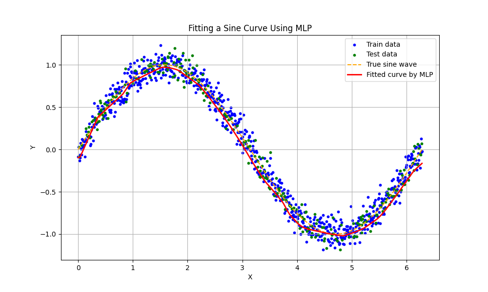
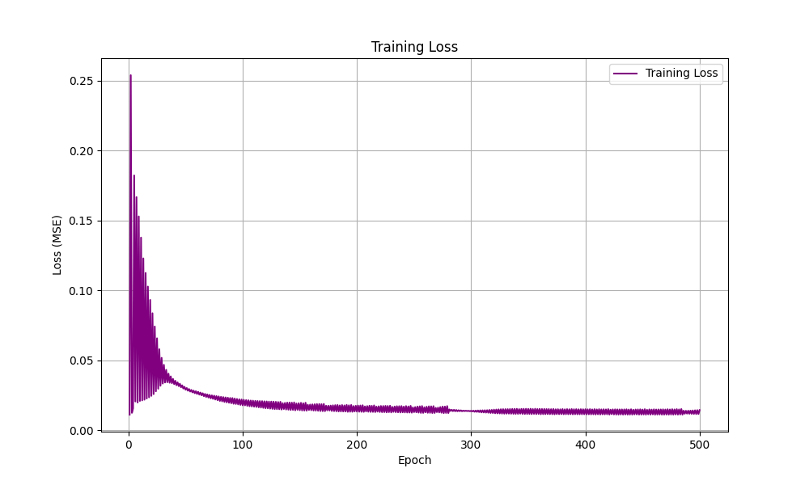
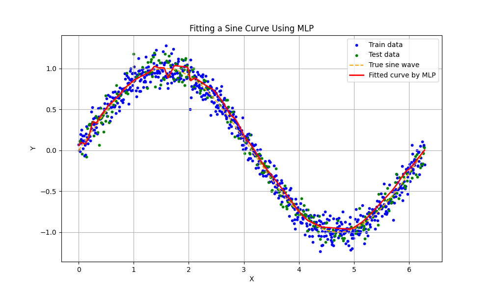
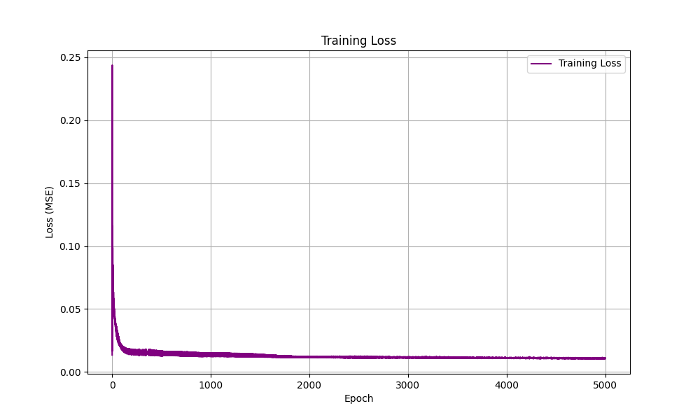
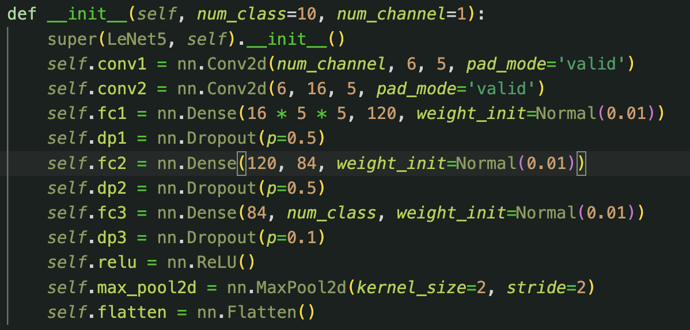
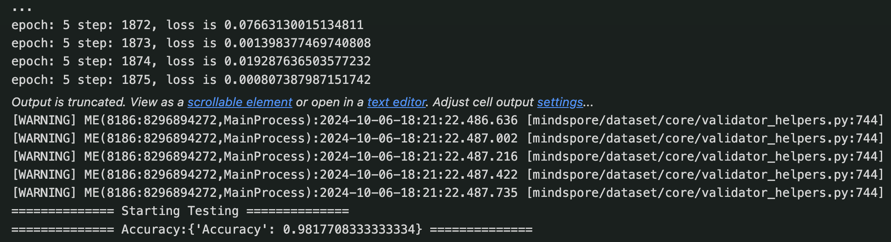

# LeNet-5 的 MindSpore 框架训练报告

## 一、任务完成摘要

### 1. 目标
在这次的工程实践创新项目II中，我们的目标是使用`MindSpore`框架实现`LeNet-5`模型来训练和识别手写数字。本项目通过详细的步骤展示了从环境设置到模型训练的完整过程，并对模型的性能和结果进行分析。

### 2. 内容
- 了解人工神经网络的基本原理以及反向传播（BP）算法
- 基于BP网络实现手写数字识别（此处使用`pytorch`深度学习框架）
- （此处使用`scikit-learn`机器学习库）
- 了解卷积神经网络的基本原理以及`LeNet-5`的经典组成结构
- 了解并安装`MindSpore`深度学习框架，并在此基础上实现`LeNet-5`

### 3. 完成情况
- 成功使用`MLP`拟合正弦曲线
- 成功安装并配置`MindSpore`框架
- 成功在`MNIST`数据集的基础上进行`LeNet-5`及其微调后的模型训练和预测，训练集预测准确率最高达**98%**

## 二、任务目标
- **使用BP神经网络正弦曲线并比较实际效果**：利用`MLP`（多层感知机）进行正弦曲线的拟合并利用`matplotlib`实现可视化比较
- **使用MindSpore框架实现LeNet-5模型来训练和识别手写数字**：尝试在不同数据集上进行训练并进行结构微调，对模型的性能和结果进行分析。

## 三、主要内容
### 1. 人工神经网络基本原理

人工神经网络（Artificial Neural Network, ANN）是模仿生物神经网络（如大脑）功能进行设计并试图复制人类的决策过程的算法模型。神经网络基于一组连接的单元或节点，称为人工神经元，每个神经元与其他神经元通过连接相互作用。这些连接，也被称为边，有权重关联，可以在传输过程中增强或抑制信号的强度。

#### 神经元模型
- **输入层**：接受外部输入信号，并将其传递给更深层的神经元。
- **隐藏层**：进行计算和特征提取，每个隐藏层的神经元对前一层的输出进行加权，加权和通过激活函数进行转换。
- **输出层**：产生最终的输出结果，如分类或回归值。

#### 激活函数
- **Sigmoid**：将输入映射到0和1之间，广泛用于二分类问题。
- **ReLU**：线性整流函数，用于增加网络的非线性性，解决梯度消失问题，是隐藏层的首选。

#### 反向传播算法（BP算法）
反向传播算法是一种训练人工神经网络的方法，特别适用于误差的优化。其核心思想是：
1. **前向传播**：输入信号通过网络前向传递至输出层。
2. **误差计算**：计算输出层的预测值与真实值之间的差异。
3. **反向传播**：误差从输出层反向传递回网络，更新每个连接的权重以最小化误差。

### 2. 基于BP神经网络的手写数字识别
- 基于第一次项目课的经验，利用`pytorch`以及`fashion-mnist`数据集在本地训练`lenet-5`后，结合`flask`框架构建web界面，最终实现手写数字的实时识别，附代码：
```
import torch
import torch.nn as nn
import cv2
import numpy as np

# 定义 LeNet 模型
class LeNet(nn.Module):
    def __init__(self):
        super(LeNet, self).__init__()
        self.conv1 = nn.Conv2d(1, 6, kernel_size=5, padding=2)
        self.pool1 = nn.AvgPool2d(kernel_size=2, stride=2)
        self.conv2 = nn.Conv2d(6, 16, kernel_size=5)
        self.pool2 = nn.AvgPool2d(kernel_size=2, stride=2)
        self.fc1 = nn.Linear(16 * 5 * 5, 120)
        self.fc2 = nn.Linear(120, 84)
        self.fc3 = nn.Linear(84, 10)

    def forward(self, x):
        x = torch.relu(self.conv1(x))
        x = self.pool1(x)
        x = torch.relu(self.conv2(x))
        x = self.pool2(x)
        x = x.view(-1, 16 * 5 * 5)
        x = torch.relu(self.fc1(x))
        x = torch.relu(self.fc2(x))
        x = self.fc3(x)
        return x

# 加载模型
device = torch.device('cuda' if torch.cuda.is_available() else 'cpu')
net = LeNet()
net.load_state_dict(torch.load('LeNet.params', map_location=device))
net.to(device)
net.eval()

# 类别标签
class_names = [str(i) for i in range(10)]

# 打开摄像头
cap = cv2.VideoCapture(0)

if not cap.isOpened():
    print("无法打开摄像头")
    exit()

while True:
    ret, frame = cap.read()
    if not ret:
        print("无法接收帧，结束程序")
        break

    # 转换为灰度图像
    gray = cv2.cvtColor(frame, cv2.COLOR_BGR2GRAY)

    # 应用高斯滤波去噪
    gray = cv2.GaussianBlur(gray, (5, 5), 0)

    # 二值化处理
    _, thresh = cv2.threshold(gray, 90, 255, cv2.THRESH_BINARY_INV)

    # 寻找轮廓
    contours, _ = cv2.findContours(thresh.copy(), cv2.RETR_EXTERNAL, cv2.CHAIN_APPROX_SIMPLE)

    # 遍历轮廓
    for contour in contours:
        x, y, w, h = cv2.boundingRect(contour)
        # 过滤小区域
        if w >= 10 and h >= 10:
            roi = thresh[y:y+h, x:x+w]
            # 调整大小为28x28
            resized = cv2.resize(roi, (28, 28), interpolation=cv2.INTER_AREA)
            # 归一化并转换为张量
            img_tensor = torch.tensor(resized, dtype=torch.float32).unsqueeze(0).unsqueeze(0) / 255.0
            img_tensor = img_tensor.to(device)

            # 模型预测
            with torch.no_grad():
                outputs = net(img_tensor)
                _, predicted = torch.max(outputs.data, 1)
                predicted_label = predicted.item()

            # 在帧上绘制矩形和预测结果
            cv2.rectangle(frame, (x, y), (x + w, y + h), (0, 255, 0), 2)
            cv2.putText(frame, f'{predicted_label}', (x, y - 10),
                        cv2.FONT_HERSHEY_SIMPLEX, 1, (255, 0, 0), 2)

    # 显示帧
    cv2.imshow('Handwritten Digit Recognition', frame)

    # 按下 'q' 键退出
    if cv2.waitKey(1) & 0xFF == ord('q'):
        break

# 释放摄像头并关闭窗口
cap.release()
cv2.destroyAllWindows()

```

### 3.基于BP网络拟合正弦曲线并绘图比较实际效果
- 首先通过`numpy`库人工构建了含有噪声的正弦波，接着利用`scikit-learn`库进行训练集和测试集的随机划分，并采用`MLP`进行训练，附代码与可视化结果：
```
import numpy as np
import matplotlib.pyplot as plt
from sklearn.neural_network import MLPRegressor
from sklearn.model_selection import train_test_split
from sklearn.metrics import mean_squared_error

# 生成数据
x = np.linspace(0, 2 * np.pi, 1000).reshape(-1, 1)  # 转化为二维数组
y = np.sin(x).ravel() + np.random.normal(0, 0.1, size=x.shape).ravel()  # 添加噪声

# 拆分训练集和测试集
x_train, x_test, y_train, y_test = train_test_split(x, y, test_size=0.25, random_state=42)

# 创建和训练神经网络模型
mlp = MLPRegressor(hidden_layer_sizes=(512, 256), activation='relu', solver='adam', warm_start=True, random_state=42)

# 训练过程，记录每次训练的损失
num_epochs = 500
loss_values = []

for epoch in range(num_epochs):
    mlp.fit(x_train, y_train)  # 每次迭代更新模型
    y_train_pred = mlp.predict(x_train)
    
    # 计算均方误差
    loss = mean_squared_error(y_train, y_train_pred)
    loss_values.append(loss)
    
    if (epoch + 1) % 100 == 0:
        print(f'Epoch [{epoch+1}/{num_epochs}], Loss: {loss:.4f}')

# 预测
y_pred_train = mlp.predict(x_train)
y_pred_test = mlp.predict(x_test)

# 在整个 x 上进行预测，用于绘制拟合的曲线
y_pred_all = mlp.predict(x)

# 可视化结果
plt.figure(figsize=(10, 6))

# 绘制原始数据
plt.scatter(x_train, y_train, label='Train data', color='blue', s=10)
plt.scatter(x_test, y_test, label='Test data', color='green', s=10)

# 绘制真实的正弦曲线
plt.plot(x, np.sin(x), label='True sine wave', color='orange', linestyle='dashed')

# 绘制拟合的曲线
plt.plot(x, y_pred_all, label='Fitted curve by MLP', color='red', linewidth=2)

plt.title('Fitting a Sine Curve Using MLP')
plt.xlabel('X')
plt.ylabel('Y')
plt.legend()
plt.grid(True)
plt.show()

# 绘制损失曲线
plt.figure(figsize=(10, 6))
plt.plot(range(1, num_epochs + 1), loss_values, label='Training Loss', color='purple')
plt.title('Training Loss')
plt.xlabel('Epoch')
plt.ylabel('Loss (MSE)')
plt.grid(True)
plt.legend()
plt.show()
```
- **500 epochs下的训练结果**
  
  

- **5000 epochs下的训练结果**
  
  

### 4. 了解卷积神经网络的基本原理以及LeNet-5的经典组成结构

卷积神经网络（Convolutional Neural Network, CNN）是一种专门用于处理具有类似网格结构的数据（如图像）的深度学习网络。CNN在图像识别、图像分类、物体检测和视频分析等领域表现出色，主要是因为它能够自动提取图像中的重要特征，无需任何人工干预。

#### CNN的基本组件包括：
- **卷积层**：通过卷积核在输入图像上滑动，执行元素乘和操作，用以提取图像中的局部特征。每一个卷积核负责提取图像的一种特征，比如边缘、颜色或者纹理。
- **激活层**（通常是ReLU层）：用于引入非线性因素，解决线性模型不能有效处理复杂模式的问题。
- **池化层**（也称为下采样或汇聚层）：减少数据的空间大小，从而减少参数的数量和计算的复杂性，提高特征检测的不变性。
- **全连接层**：在网络的最后，将前面层的输出转化为最终的类别分数。

#### LeNet-5结构
LeNet-5，由Yann LeCun于1998年提出，是早期的卷积神经网络之一，特别设计用于手写数字识别。LeNet-5的结构简洁而高效，通常被认为是现代卷积网络的开山之作。它主要包含以下层次：

1. **C1卷积层**：使用大小为5x5的6个卷积核，输出6个特征图（feature maps），每个图的大小为28x28。
2. **S2池化层**：对C1层的输出进行下采样，使用2x2的池化窗口，输出6个14x14的特征图。
3. **C3卷积层**：进一步的卷积操作，使用16个卷积核对S2层的特征图进行卷积，输出16个10x10的特征图。
4. **S4池化层**：再次下采样，输出16个5x5的特征图。
5. **C5全连接层**：将S4层的输出展平后连接到120个神经元上。
6. **F6全连接层**：连接120个输入到84个输出神经元。
7. **输出层**：使用softmax或者传统的逻辑回归，将F6层的输出映射到最终的类别概率上。

### 5.安装MindSpore框架并实现LeNet-5的训练和微调
- 下载`MNIST`数据集后基于经典`LeNet-5`的原始代码进行训练：
```
import os
import argparse
import mindspore.dataset as ds
import mindspore.nn as nn
from mindspore.train import Model
from mindspore.train.callback import ModelCheckpoint, CheckpointConfig, LossMonitor, TimeMonitor
from mindspore.train.serialization import load_checkpoint, load_param_into_net
from mindspore.common.initializer import Normal
from mindspore import context
import mindspore.dataset.vision.c_transforms as CV
import mindspore.dataset.transforms.c_transforms as C
from mindspore.dataset.vision import Inter
from mindspore.nn import Accuracy
from mindspore.common import dtype as mstype
from mindspore.nn import SoftmaxCrossEntropyWithLogits

def create_dataset(data_path, batch_size=32, repeat_size=1,
                   num_parallel_workers=1):
    """ create dataset for train or test
    Args:
        data_path: Data path
        batch_size: The number of data records in each group
        repeat_size: The number of replicated data records
        num_parallel_workers: The number of parallel workers
    """
    # define dataset
    mnist_ds = ds.MnistDataset(data_path)

    # define operation parameters
    resize_height, resize_width = 32, 32
    rescale = 1.0 / 255.0
    shift = 0.0
    rescale_nml = 1 / 0.3081
    shift_nml = -1 * 0.1307 / 0.3081

    # define map operations
    resize_op = CV.Resize((resize_height, resize_width), interpolation=Inter.LINEAR)  # Resize images to (32, 32)
    rescale_nml_op = CV.Rescale(rescale_nml, shift_nml) # normalize images
    rescale_op = CV.Rescale(rescale, shift) # rescale images
    hwc2chw_op = CV.HWC2CHW() # change shape from (height, width, channel) to (channel, height, width) to fit network.
    type_cast_op = C.TypeCast(mstype.int32) # change data type of label to int32 to fit network

    # apply map operations on images
    mnist_ds = mnist_ds.map(operations=type_cast_op, input_columns="label", num_parallel_workers=num_parallel_workers)
    mnist_ds = mnist_ds.map(operations=resize_op, input_columns="image", num_parallel_workers=num_parallel_workers)
    mnist_ds = mnist_ds.map(operations=rescale_op, input_columns="image", num_parallel_workers=num_parallel_workers)
    mnist_ds = mnist_ds.map(operations=rescale_nml_op, input_columns="image", num_parallel_workers=num_parallel_workers)
    mnist_ds = mnist_ds.map(operations=hwc2chw_op, input_columns="image", num_parallel_workers=num_parallel_workers)

    # apply DatasetOps
    buffer_size = 10000
    mnist_ds = mnist_ds.shuffle(buffer_size=buffer_size)  # 10000 as in LeNet train script
    mnist_ds = mnist_ds.batch(batch_size, drop_remainder=True)
    mnist_ds = mnist_ds.repeat(repeat_size)

    return mnist_ds

class LeNet5(nn.Cell):
    """Lenet network structure."""
    # define the operator required
    def __init__(self, num_class=10, num_channel=1):
        super(LeNet5, self).__init__()
        self.conv1 = nn.Conv2d(num_channel, 6, 5, pad_mode='valid')
        self.conv2 = nn.Conv2d(6, 16, 5, pad_mode='valid')
        self.fc1 = nn.Dense(16 * 5 * 5, 120, weight_init=Normal(0.02))
        self.fc2 = nn.Dense(120, 84, weight_init=Normal(0.02))
        self.fc3 = nn.Dense(84, num_class, weight_init=Normal(0.02))
        self.dp = nn.Dropout(p=0.5)
        self.relu = nn.ReLU()
        self.max_pool2d = nn.MaxPool2d(kernel_size=2, stride=2)
        self.flatten = nn.Flatten()

    # use the preceding operators to construct networks
    def construct(self, x):
        x = self.max_pool2d(self.relu(self.conv1(x)))
        x = self.max_pool2d(self.relu(self.conv2(x)))
        x = self.flatten(x)
        x = self.relu(self.fc1(x))
        x = self.relu(self.fc2(x))
        x = self.fc3(x)
        return x

        def train_net(network_model, epoch_size, data_path, repeat_size, ckpoint_cb, sink_mode):
    """Define the training method."""
    print("============== Starting Training ==============")
    # load training dataset
    ds_train = create_dataset(os.path.join(data_path, "train"), 32, repeat_size)
    network_model.train(epoch_size, ds_train, callbacks=[ckpoint_cb, LossMonitor()], dataset_sink_mode=sink_mode)


def test_net(network, network_model, data_path):
    """Define the evaluation method."""
    print("============== Starting Testing ==============")
    # load the saved model for evaluation
    param_dict = load_checkpoint("checkpoint_lenet-1_1875.ckpt")
    # load parameter to the network
    load_param_into_net(network, param_dict)
    # load testing dataset
    ds_eval = create_dataset(os.path.join(data_path, "test"))
    acc = network_model.eval(ds_eval, dataset_sink_mode=False)
    print("============== Accuracy:{} ==============".format(acc))

device_target = "CPU" #choices=['Ascend', 'CPU']
context.set_context(mode=context.GRAPH_MODE, device_target=device_target)
dataset_sink_mode = not device_target == "CPU"
# download mnist dataset
# learning rate setting
lr = 0.01
momentum = 0.9
dataset_size = 1
mnist_path = "./MNIST"
# define the loss function
net_loss = SoftmaxCrossEntropyWithLogits(sparse=True, reduction='mean')
train_epoch = 5
# create the network
net = LeNet5()
# define the optimizer
net_opt = nn.Momentum(net.trainable_params(), lr, momentum)
config_ck = CheckpointConfig(save_checkpoint_steps=1875, keep_checkpoint_max=10)
# save the network model and parameters for subsequence fine-tuning
ckpoint = ModelCheckpoint(prefix="checkpoint_lenet", config=config_ck)
# group layers into an object with training and evaluation features
model = Model(net, net_loss, net_opt, metrics={"Accuracy": Accuracy()})

train_net(model, train_epoch, mnist_path, dataset_size, ckpoint, dataset_sink_mode)
test_net(net, model, mnist_path)

from mindspore.train.serialization import load_checkpoint, save_checkpoint, export
import numpy as np
from mindspore import Tensor
network = LeNet5()
load_checkpoint("./checkpoint_lenet-1_1875.ckpt", network)
input_data = np.random.uniform(0.0, 1.0, size = [1, 1, 32, 32]).astype(np.float32)
export(network, Tensor(input_data), file_name = './MNIST', file_format = 'ONNX') 
```
- 训练结果：
  

- 在每一个全脸阶层后添加一个dropout层并微调丢弃概率p后进行训练，发现预测准确率变化不大：
  
  

## 四、主要思路及关键步骤

在本项目中，我们采用了结构化的方法来完成手写数字识别和正弦曲线拟合的任务。以下是关键步骤的详细描述：

### 1. 数据准备
- **数据获取**：从`MNIST`数据集下载数据。
- **数据预处理**：对数据进行标准化处理，以确保模型训练的有效性。

### 2. 模型构建
- **选择模型**：根据任务的不同，选择合适的神经网络模型。对于手写数字识别，我们选择了`LeNet-5`，而对于正弦曲线拟合，我们使用了多层感知机（MLP）。
- **模型配置**：配置网络层、激活函数和优化器等。

### 3. 模型训练与调试
- **训练过程**：设置适当的批次大小和迭代次数，监控训练过程中的损失和准确率。
- **调试策略**：在训练过程中调整参数，如学习率和批次大小，以优化模型性能。
- **问题解决**：分析模型潜在的过拟合或欠拟合问题，并应用如dropout或正则化等技术来解决。

## 五、完成情况与结果分析

### 1. 训练结果
- **手写数字识别**：`LeNet-5`模型在`MNIST`数据集上达到了98%的准确率，展示了极高的性能。
- **正弦曲线拟合**：MLP模型能够很好地拟合带噪声的正弦数据，显示出良好的泛化能力；但如果训练epoch过多可能会造成过拟合的问题，模型可能将部分噪声放大导致最终的曲线不够平滑。

### 2. 验证与测试
- 对模型进行了严格的验证和测试，确保了其在未见数据上的稳定性和高效性。

### 3. 性能指标
- 提供了详细的性能评估报告，包括准确率、损失曲线和运行时间等。

### 4. 错误分析
- 对错误分类的样本进行了分析，探索了误分类的可能原因，如图像质量问题或模型对特定特征的敏感性。

## 六、总结

### 1. 学习成果
- 通过这次项目，不仅掌握了`MindSpore`框架的使用，还深入了解了神经网络的基本原理和关键技术。

### 2. 面临的挑战
- 在训练过程中，我们面临了数据集的下载与读取失败等问题。

### 3. 改进方向
- 未来工作将探讨使用更复杂的模型如`ResNet`或`DenseNet`，以及实现模型的移动部署。

### 4. 社会影响和科技前沿
- 本项目的成果有望应用于自动化和智能化领域，如自动驾驶、医疗图像分析等，具有广阔的应用前景。

---